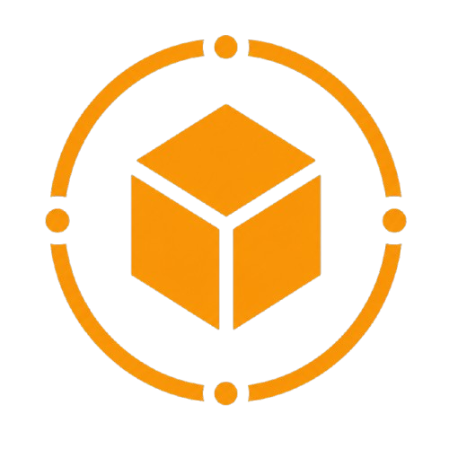

<div align="center">



# STOCK SPHERE
### Warehouse & Inventory Management System


*A full-stack warehouse management platform for tracking products, containers,*
*and stock movement across multiple warehouses — with full audit traceability.*

[Features](#-features) · [Architecture](#-architecture) · [Quick Start](#-quick-start) · [Roles & Permissions](#-roles--permissions) · [Tech Stack](#-built-with)

</div>

---

## 📌 Overview

**Stock Sphere** is a full-stack inventory and warehouse management system built with **NestJS**, **React**, and **PostgreSQL** (via **Drizzle ORM**). It models the complete physical hierarchy of a warehouse operation — warehouses → containers → products — and tracks every stock movement with a tamper-visible audit trail.

Designed around **role-based access control**, Stock Sphere gives admins, managers, staff, and auditors exactly the permissions their job needs, while keeping every stock-in, stock-out, and record change logged and attributable.

---

## ✨ Features

### 🏢 Warehouse & Container Hierarchy
- Manage warehouses, and the containers stored inside them
- Live container capacity tracking — current vs. maximum
- Dashboard flags for **full** and **empty** containers/warehouses at a glance

### 📦 Product Catalog
- Products organized under **Product Types**, which belong to **Categories**
- Brand, model, and price tracking per product
- Sortable and searchable by brand, model, price, or quantity

### 📊 Inventory Tracking
- Real-time stock levels per product, per container
- Filter inventory by brand, model, category, product type, container, or quantity range
- Paginated inventory search across the full warehouse network

### 🔄 Stock Movement
- **Stock In / Stock Out** actions with reason codes — `SOLD` · `DAMAGED` · `EXPIRED` · `OUTDATED`
- Every movement recorded against the product, container, and acting user

### 🔐 Authentication & Access Control
- JWT-based authentication with bcrypt password hashing
- Role-Based Access Control — `ADMIN` · `MANAGER` · `STAFF` · `AUDITOR`
- Fine-grained, permission-driven UI — actions render only when the logged-in role allows them

### 📋 Audit Log
- Every create, update, delete, stock-in, stock-out, and login is logged
- Entries capture the acting user's role, the entity affected, and a human-readable description
- Dedicated Audit page for full traceability across the system

### 📈 Home Dashboard
- Live counts across products, containers, warehouses, categories, and product types
- Today's stock-in / stock-out activity at a glance
- User breakdown by role (Admins, Managers, Staff, Auditors)

---

## 🏗️ Architecture

Stock Sphere is a two-package monorepo:

```
Stock-Sphere/
├── backend/     NestJS API — modular by domain (auth, user, warehouse, container,
│                category, product, product_type, inventory, audit, dashboard)
└── frontend/    React SPA — mirrors the backend module-for-module
                 (api → hooks → components → pages)
```

Each backend module follows the same shape — `controller`, `service`, `module`, `dto/` — with `.spec.ts` unit tests alongside both controllers and services. The database layer uses **Drizzle ORM** with a fully typed schema and enum-driven constraints (`db/schema`, `db/enums`).

The frontend mirrors this structure 1:1: a typed `api/` client per domain, a `hooks/` layer wrapping **TanStack Query**, domain-organized `components/`, and a page per module — all gated by a `usePermission` hook driven by the logged-in user's role.

---

## ⚡ Quick Start

### 1. Clone the repository

```bash
git clone https://github.com/bilalxfaisal/Stock-Sphere.git
cd Stock-Sphere
```

### 2. Install dependencies

Install dependencies for the root project, backend, and frontend:

```bash
npm install

cd backend
npm install

cd ../frontend
npm install

cd ..
```

### 3. Configure environment variables

Create a `.env` file inside the `backend` folder:

```text
backend/.env
```

Configure your PostgreSQL database connection and JWT secret in the `.env` file.

### 4. Setup the database

From the project root, run:

```bash
cd backend
npx drizzle-kit push
cd ..
```

### 5. Start the application

From the project root:

```bash
npm run dev
```

This starts both the **NestJS backend** and **React/Vite frontend** simultaneously.

### Default URLs

- **Frontend:** http://localhost:6063
- **Backend:** http://localhost:6006
---

## 🔐 Roles & Permissions

| Role | Access |
|------|--------|
| **ADMIN** | Full access — users, warehouses, categories, containers, product types, products, inventory, and audit log |
| **MANAGER** | View warehouses/categories/containers/product types, manage products, stock in/out, view inventory |
| **STAFF** | View products, stock in/out, view inventory |
| **AUDITOR** | Read-only access across warehouses, categories, containers, product types, products, and inventory |

---

## 🛠️ Built With

**Backend**
- **[NestJS 11](https://nestjs.com/)** — Modular Node.js framework
- **[Drizzle ORM](https://orm.drizzle.team/)** + **PostgreSQL** — Typed schema and queries
- **[Passport + JWT](https://www.passportjs.org/)** — Authentication
- **[bcrypt](https://www.npmjs.com/package/bcrypt)** — Password hashing
- **[class-validator](https://github.com/typestack/class-validator)** — DTO validation
- **[Jest](https://jestjs.io/)** — Unit testing

**Frontend**
- **[React 19](https://react.dev/)** + **[TypeScript](https://www.typescriptlang.org/)**
- **[Vite](https://vitejs.dev/)** — Build tooling
- **[TanStack Query](https://tanstack.com/query)** — Server state management
- **[React Hook Form](https://react-hook-form.com/)** + **[Zod](https://zod.dev/)** — Forms and validation
- **[Tailwind CSS 4](https://tailwindcss.com/)** + **shadcn/ui** — Styling and components
- **[Axios](https://axios-http.com/)** — API client

---

<div align="center">

*Built as a full-stack systems project demonstrating role-based access control,*
*audit-traceable stock management, and typed end-to-end architecture.*

⭐ **Star this repo if you found it useful!**

</div>